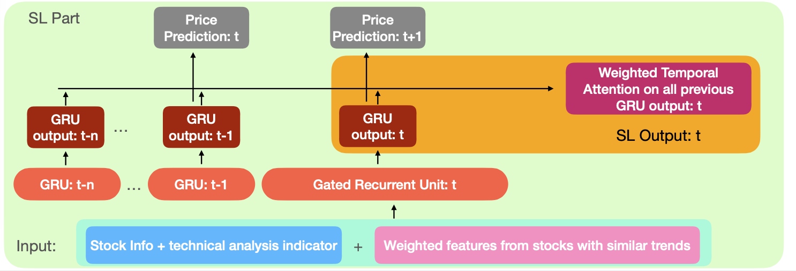
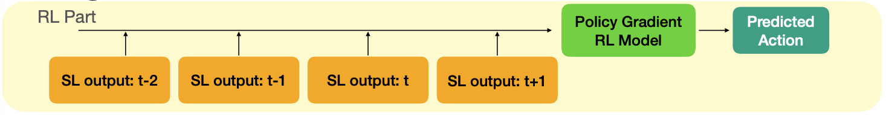
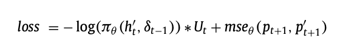
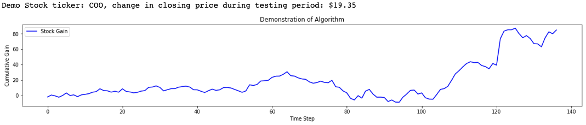
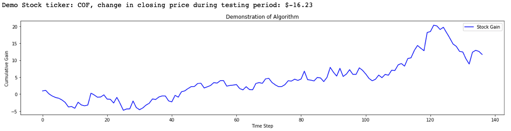
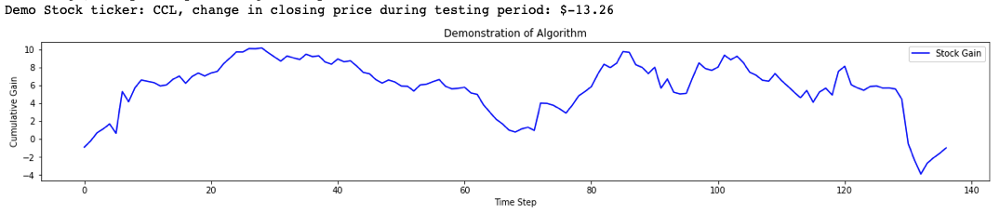
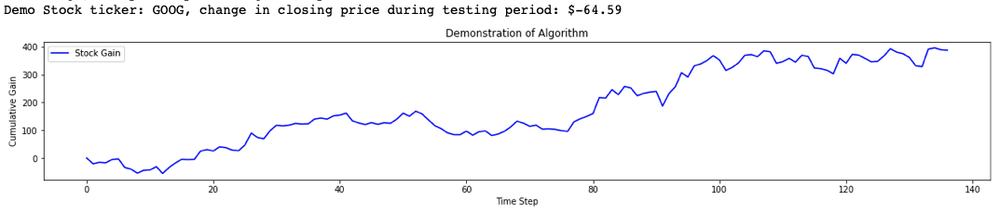

# TFJ-DRL-Replication
A paper replication project for *Time-driven feature-aware jointly deep reinforcement learning (TFJ-DRL) for financial signal representation and algorithmic trading*. 

Algorithmic trading has become a hot topic since the adoption of computers in stock exchanges. There are two categories of algorithmic trading, one based on prior knowledge and another based on machine learning (ML). The latter is gaining more attentions these days, as comparing to methods based on prior knowledge, ML based methods does not require professional financial knowledge, research, or trading experience. 

However, there are several drawbacks to previous implementations of machine learning algorithmic trading:  

* Supervised learning methods are difficult to achieve online learning, due to the cost of training. They attempt to predict stock prices of the next time point, but accuracy of price prediction results in second error propagation during translation from price prediction to trading actions.

* Reinforcement learning (RL) methods lacks the ability to perceive and represent environment features, as well as the ability to dynamically consider past states and changing trends. 

The paper of interest (TFJ-DRL) aims to combine the strength from both deep learning and reinforcement learning by integrating Recurrent Neural Network (RNN) and policy gradient RL.

Through this document, I'm going to detail the steps I took and decisions I made to replicate the model TFJ-DRL. 

## Content Overview

This document is divided into 9 parts:

0. Developement Environment
1. Data used in model and data acquisition
2. Data preprocessing
3. RNN model and Temporal Attention Mechanism definition
4. Reinforcement model definition
5. Utility functions, and Loss function
6. Model training and weight selection
7. Model performance testing
8. Link to paper and other resources

## Development Environment

The python packages used in the project include: PyTorch, TorchVision, Numpy, Pandas, MatplotLib, YFinance, Statsmodels and TA-Lib.

YFinance, Statsmodels, and TA-Lib can be installed via:
```
conda install -c anaconda statsmodels
conda install -c ranaroussi yfinance
conda install -c quantopian ta-lib
```

On Google Colab, TA-Lib needs to be seperated installed via:
```
!wget http://prdownloads.sourceforge.net/ta-lib/ta-lib-0.4.0-src.tar.gz
!tar -xzvf ta-lib-0.4.0-src.tar.gz
%cd ta-lib
!./configure --prefix=/usr
!make
!make install
!pip install Ta-Lib
```

## Data used in model and data acquisition

Data used in the projects are daily stock trading history that can be downloaded from Yahoo Finance. The historical stock data used in the project is from Jan 2013 to Dec 2018.

A sample data snippet looks like:

| Time | Open | Close | High | Low | Volume
| ------- | ------- | ------- | ------- | ------- | ------- |
| 2018/01/02 | 683.73 | 695.89 | 682.36 | 695.81 | 7250000 |
| 2018/01/03 | 697.85 | 714.37 | 697.77 | 713.06 | 8660000 |
| ... | ... | ... | ... | ... | ... |

For each stock, given its ticker and the start/end time we are interested in, we can get the required data via:
```
#read daily stock data series from yahoo finance
def get_data(name, start="2017-01-01", end="2020-01-01"):
    ticker = yf.Ticker(name)
    data=ticker.history(start=start,  end=end)
    return data.drop(['Dividends', 'Stock Splits'], axis=1, errors='ignore')
```

Here, we delete *Dividents* and *Stock Splits* columns because they are not required in the model. 

## Data preprocessing

Next, given the full stock data, we will use TA-Lib to calculate technical analysis indicators for each day:
```
def calc_tech_ind(data):
    #overlap 
    data['upbd'], data['midbd'], data['lowbd'] = ta.BBANDS(data["Close"])
    data['dema'] = ta.DEMA(data["Close"], timeperiod=30)
    data['tema'] = ta.TEMA(data["Close"], timeperiod=30)
    ...

    return data
```

In total, 40 features are calculated from Overlap Studies, Momentum Indicators, Volume Indicators, Volitility Indicators, and Cycle Indicators. 

Together with the original 5 features (*Time* is not a feature), there are 45 features for each stock. 

However, for this model, to complete features for stock **X**, the stock we are interested in, we will also consider features from stocks with similar trends with **X**. 

To do this, we need to first have a predetermined list of stocks to consider, and calculate features for each of them:
```
def get_data_set(stock_id, name_list, start="2017-01-01", end="2020-01-01"):
    data_list=[]
    for name in name_list:
        data_list.append(calc_tech_ind(get_data(name, start, end)).iloc[90:].fillna(0).values)
    ...
```

Next up, we need to compute the correlation between X and each stock from the list, and it can be computed in Cointegration test. Cointegration test outputs a value between [0, 1], with smaller values indicate larger correlations. The *high_correlation_list* is a list containing the index of stocks with similar trends as **X**. 
```
def get_data_set(stock_id, name_list, start="2017-01-01", end="2020-01-01"):
    ...
        
    #get number of original
    feature_count=data_list[0].shape[1]
    #calculate cointegration
    high_correlation_list=[]
    for j in range(len(data_list)):
        if stock_id != j:
            coint=ts.coint(data_list[stock_id][:, 3], data_list[j][:, 3])[1] 
            if coint <= 0.1:
                high_correlation_list.append(j)
            
    return data_list, high_correlation_list
```

To make *Back Propagation Through Time* easier for training, we need to slice our long dataset into shorter pieces. But first, we will need to concatenate features from stocks with high correlation trends:
```
def toSequential(stock_id, name_list, timeStep=24, gap=12, start="2017-01-01", 
                 end="2020-01-01", use_external_list=False, external_list=[]):
    data_list, hcl=get_data_set(stock_id, name_list, start=start, end=end) 
    #For Validation and Testing, keep using the same HCL list. 
    if (use_external_list):
      hcl=external_list
      
    #append coint features to the end
    avg_features=np.zeros((data_list[stock_id].shape[0], data_list[stock_id].shape[1]-4))
    for k in hcl:
        feature=data_list[k][:, 4:]
        avg_features+=(feature-feature.mean(axis=0, keepdims=True))/(feature.std(axis=0, keepdims=True))
    #append to the end
    stkData=np.concatenate([data_list[stock_id], avg_features], axis=1)

```

In addition to *X*(normalized stock features of t), *y*(normalized close price of t+1) we will have *z*(normalized price difference between t+1 and t) and *zp*(un-normalized price difference between t+1 and t). As *y* and *z* will be used during training and *z* and *zp* will be used during evaluation and testing. 

```
#generate x, y, z, zp quadruples to sequence according to $timeStep and $gap
#x: historical data w/ technical analysis indicator
#y: closing price of t+1
#z:  difference between t+1 and t step's closing price
#zp:  difference between t+1 and t step's closing price, un-normalized
#hcl: high correlation list from get_data_set function
def toSequential(stock_id, name_list, timeStep=24, gap=12, start="2017-01-01", 
                 end="2020-01-01", use_external_list=False, external_list=[]):
	...

    #closing: from id=0 to last
    closing=stkData[:, 3]
    #data from id=0 to second to last
    data=stkData[:-1]
    #calculating number of available sequential samples
    data_length=len(data)
    count=(data_length-timeStep)//gap+1
    stockSeq=[]
    labelSeq=[]
    diffSeq=[]
    realDiffSeq=[]
    for i in range(count):
        #segData dims: [timestep, feature count]
        segData=data[gap*i:gap*i+timeStep]
        segClosing=closing[gap*i:gap*i+timeStep+1]
        #segDiff=diff[gap*i:gap*i+timeStep]
        #normalization
        segDataNorm=np.nan_to_num((segData-segData.mean(axis=0, keepdims=True))/segData.std(axis=0, keepdims=True))
        segClosingNorm=(segClosing-segClosing.mean())/segClosing.std()
        #segDiff=(segDiff-segDiff.mean())/segDiff.std()
        
        stockSeq.append(segDataNorm)
        labelSeq.append(segClosingNorm[1:])
        diffSeq.append(segClosingNorm[1:]-segClosingNorm[:-1])
        realDiffSeq.append(segClosing[1:]-segClosing[:-1])
    stockSeq=np.array(stockSeq)
    labelSeq=np.array(labelSeq)
    diffSeq=np.array(diffSeq)
    realDiffSeq=np.array(realDiffSeq)
    return (stockSeq.astype('float32'), labelSeq.astype('float32'),
    diffSeq.astype('float32'), realDiffSeq.astype('float32'), hcl)

```

The final step is run-of-the-mill dataset definition:
```
#input each step:  vector including [stock info, tech indicators]
#output each step: closing price t+1, price diff between t+1 and t
#full_list: output from get_data_set

class StockDataset(Dataset):
    def __init__(self, stock_id, name_list, transform=None, timestep=24, gap=12,
                 start="2017-01-01", end="2020-01-01",
                 use_external_list=False, external_list=[]):
        self.transform=transform
        self.id=stock_id
        
        
        #load data into cohort
        X, y, z, zp, hcl=toSequential(stock_id, name_list, timeStep=timestep, 
                                      gap=gap, start=start, end=end, 
                                      use_external_list=use_external_list, 
                                      external_list=external_list)

        self.X=X
        self.y=y  
        self.z=z  
        self.zp=zp
        self.high_correlation_list=hcl
        
    def __len__(self):
        return len(self.y)
    
    def __getitem__(self, idx):
        """
        data returned in the format of 
        """
        if torch.is_tensor(idx):
            idx=idx.tolist()
        
        data=self.X[idx]
        label1=self.y[idx]
        label2=self.z[idx]
        label3=self.zp[idx]
        if self.transform:
            data=self.transform(data)
        return (data, label1, label2, label3)
    
    def getHighCorrelationList(self):
        return self.high_correlation_list

    def getDS(self):
        return self.X, self.y, self.z, self.zp
```

## RNN model and Temporal Attention Mechanism definition

The overview of Supervised Learning part is as follows:



The Supervised Learning part uses Gated Recurrent Unit, and it can be easily defined:
```
#define GRU class
#init parameter: env_size for RL algorithm
class GRU(nn.Module):
    def __init__(self, env_size):
        super(GRU, self).__init__()
        self.rnn=nn.GRU(
            input_size=86,
            hidden_size=128,
            num_layers=1,
            batch_first=True
        )
        self.num_layers=1
        ...

    def begin_state(self, device, batch_size=1): 
        # `nn.GRU` takes a tensor as hidden state
        return torch.zeros((
                    self.rnn.num_layers, batch_size, 128), device=device)

    ...
```

However, the forward function is slightly different. On top of each GRU's output at each time step t, there is a Temporal Attention Mechanism that tries to find the similarity between GRU time t's output and all previous timesteps' output from time 0. This is achieved by computing all previous timestep's SoftMax with time t's output and summed into a weighted vector of same length as GRU's output. 

```
#temporal attention mechanism calculation
def tam(states, device):
    """
    Given $states: batch_size, time_step, hidden_size
    return $output states: batch_size, time_step, hidden_size*2
    """
    with torch.no_grad():
        b_size, t_step, h_size=states.shape
        # $time_step 0 
        vec_list=torch.tensor(np.zeros([b_size, 1, h_size]).astype('float32')).to(device)
        
        #i: time step from 1 to $time_step
        for i in range(1,states.shape[1]):
            batchedCum=torch.tensor(np.zeros([b_size, 1,1]).astype('float32')).to(device)
            batch_list=[]
            vec=torch.tensor(np.zeros([b_size, 1, h_size]).astype('float32')).to(device)
            for j in range(i):
                batched=torch.exp(torch.tanh(
                    torch.bmm(states[:,i:i+1,:], 
                              torch.transpose(states[:,j:j+1,:], 1, 2))))
                batch_list.append(batched)
                batchedCum+=batched
            for j in range(i):
                vec+=torch.bmm((batch_list[j]/batchedCum), states[:, j:j+1, :])
            vec_list=torch.cat([vec_list,vec], axis=1)
        #result=torch.cat([states, vec_list],axis=2)
    return vec_list
```

Also, on top of the whole structure, there are 2 stacked linear layers trying to predict the price of time t+1. It basically serves as the decoder to the environment. So the rest of the initialization function and the forward function can be defined as follow:

```
#define GRU class
#init parameter: env_size for RL algorithm
class GRU(nn.Module):
    def __init__(self, env_size):
    	...
        self.linear1=nn.Linear(256, env_size)
        self.linear2=nn.Linear(env_size, 1)

	...
        
    def forward(self, x, state, device):
        batch_size,timestep, _=x.shape
        states, state=self.rnn(x, state)
        tamVec=tam(states, device)
        
        #concatVec: batch_size, time_step, hidden_size*2
        #i.e.       batch_size, 24       , 256        
        concatVec=torch.cat([states, tamVec],axis=2)
        envVec=self.linear1(torch.tanh(concatVec.reshape(batch_size*timestep, -1)))
        output=nn.Dropout(p=0.3)(envVec)
        output=nn.ReLU()(output)
        output=self.linear2(output)
        envVec=envVec.reshape(batch_size, timestep, -1)
        return (output.view(batch_size, -1), envVec), state
```
## Reinforcement model definition

The overview of Reinforcement Learning part is as follows:


The Reinforcement model is fairly easy to define, since it is a special case of reinforcement learning. We can simply use RNN cells from pytorch. RL policy outputs 3 logits representing {Short, Neutral, Long}/
```
#RL Policy net modeled by parameters
class rlPolicy(nn.Module):
    def __init__(self, env_size, device):
        super(rlPolicy, self).__init__()
        self.rnn=GRU(env_size)
        self.rl=nn.RNN(
            input_size=env_size,
            hidden_size=128,
            num_layers=1,
            batch_first=True
        )
        self.linear=nn.Sequential(nn.BatchNorm1d(128), nn.ReLU(),nn.Dropout(0.3),
                                  nn.Linear(128, 32), nn.ReLU(),nn.Dropout(0.3),
                                  nn.Linear(32, 3))
        self.device=device

    #predP: predicition of t+1 closing prce
    #output: actions from -1 to 1 in shape (`batch_size`, `num_steps`)
    def forward(self, x, state):  
        batch_size,timestep, _=x.shape  
        (predP, envVec), state1=self.rnn(x, state[0], self.device)
        output, state2=self.rl(envVec, state[1])
        output=self.linear(output.reshape(batch_size*timestep, -1))
        #predP: price prediction of t+1, output: (batch, timestep, 128) of actions
        return predP, output.view(batch_size,timestep, -1)
    
    def begin_state(self, device, batch_size=1): 
        # `nn.GRU` takes a tensor as hidden state
        return [self.rnn.begin_state(device, batch_size),
                self.rnn.begin_state(device, batch_size)]
```

## Utility functions, and Loss function

Tell pyTorch to use CPU, if GPU is not found:
```
#define device
def try_gpu(i=0):
    """Return gpu(i) if exists, otherwise return cpu()."""
    if torch.cuda.device_count() >= i + 1:
        return torch.device(f'cuda:{i}')
    return torch.device('cpu')
```

Gradient Clipping prevents gradient from exploding during training:

```
#Prevent exploding gradient
def grad_clipping(net, theta): 
    """Clip the gradient."""
    if isinstance(net, nn.Module):
        params = [p for p in net.parameters() if p.requires_grad]
    else:
        params = net.params
    norm = torch.sqrt(sum(torch.sum((p.grad ** 2)) for p in params))
    if norm > theta:
        for param in params:
            param.grad[:] *= theta / norm
```

Weight Initialization for linear layers:
```
#model weight initialization
def init_weights(m):
    if type(m) == nn.Linear or type(m) == nn.Conv2d:
        torch.nn.init.xavier_normal_(m.weight)
        m.bias.data.normal_(0.0,0.01)
```

We also need to define training, validation, testing dataset iterator generator:
```
#Generation of training, validation, and testing dataset
def DataIterGen(stock_id, name_list, demo=False):
    """
    test_id_list: id of subjects for testing
    val_id_list: id of subjects for validation
    other subjects for training
    full_list=get_data_set(name_list), preprocessed
    demo: when demo mode is True, only test_iter is returned, with data from
    first entry of test_id_list (single stock)
    """
    trainDS=StockDataset(stock_id, name_list, start="2013-01-01", end="2017-10-01")
    #get high correlation list for validation and testing
    hcl=trainDS.getHighCorrelationList()
    if demo:
      test_iter=DataLoader(StockDataset(stock_id, name_list, timestep=24, gap=1, 
                                        start="2018-01-01", end="2019-01-01",
                                        use_external_list=True, external_list=hcl), 
                           shuffle=False, batch_size=64, num_workers=0)
      
      #get abs change in stock closing price:
      data=get_data(name_list[stock_id], start="2018-01-01", end="2019-01-01")
      delta=data.iloc[-1]['Close']-data.iloc[91]['Close']
      print(f'Demo Stock ticker: {name_list[stock_id]}, change in closing price during testing period: ${delta:.2f}')
      return test_iter
    else:
      test_iter=DataLoader(StockDataset(stock_id, name_list, 
                                        start="2018-01-01", end="2019-01-01",
                                        use_external_list=True, external_list=hcl),
                            batch_size=32, num_workers=0)
      val_iter=DataLoader(StockDataset(stock_id, name_list,
                                       start="2017-07-01", end="2018-04-01",
                                       use_external_list=True, external_list=hcl),
                           batch_size=32, num_workers=0)
      train_iter=DataLoader(trainDS, shuffle=True, batch_size=32, num_workers=0)
      print(f'Stock ticker: {name_list[stock_id]}')
      return train_iter, val_iter, test_iter
```

Utility calculation for Reinforcement Learning. Here, it is calculated as the sum of price difference *z* multiplied by the trading action *a* from time 0 to time t. I.e. if at time t, *z* is negative (price decreased during the day), but the predicted action *a* is **long**, then Utility will record a loss of *za*; if the predicted action is **short**, then the Utility will be a positive *za*; and if the predicted action is **Neutral**, then the utility is unchanged. 
```
#Calculate Utility based on policy Output
#z: z from dataset
#c: transaction cost
def calcUtility(policyOutput, z, c=0.001):
  with torch.no_grad():
    discretize=policyOutput.detach()
    batch, step, _=policyOutput.shape
    #discretize: batch, step, 3
    discretize=discretize.reshape(batch*step,-1)
    discretize=torch.argmax(discretize, dim=1, keepdim=True) #{0, 1, 2}
    discretize=discretize.reshape(batch, step)
    preAction=torch.cat([discretize[:,0:1], discretize[:, :-1]], dim=1)
    #net income R
    R=z*(discretize-1)-c*((discretize-preAction)!=0)
    U=torch.cumsum(R, dim=1)
    return U, preAction
```

The Original Loss Function is as follows:


It has two terms:
* Term 1a: inside the log function, it calculates the probability of choosing the same action as last step
* Term 1b: The negative log function is modified by the total return until time t
* Term 2: MSE(Pred Price, true Price), it calculates the difference between price prediction

The original loss function is as follows:
```
#Loss function defined by paper
def lossFunc(predP, y, policyOutput, z, device):
    #MSE
    term1=nn.MSELoss()(predP, y)
    #RL
    U, preAction=calcUtility(policyOutput, z)
    U_detach=U.detach()
    sfPolicyOutput=nn.Softmax(dim=2)(policyOutput)
    actionProb=torch.squeeze(torch.gather(sfPolicyOutput, 2, torch.unsqueeze(preAction, -1)))
    term2=-torch.log(actionProb)*U_detach
    return term2.mean()+term1
```

The Term 1 works, because if Term 1b's Utility is large, but Term 1a's probability is small, then the whole Term 1 is extra large, meaning it punishes bad decisions. 

However, the loss funtion does not encourage good actions, i.e. Term 1a is high, and Term 1b is also high. We can add a third term to do this and improve training and learning:

* Term 3: CrossEntropyLoss(Predicted action, greedy action), the greedy action is just the optimal action at time t to maximize profits. 

Thus the modified loss function is as follows:
```
#greedy loss function
def lossFunc2(predP, y, policyOutput, z, device):
    #MSE
    term1=nn.MSELoss()(predP, y)
    #RL
    greedyAction=(z>=0.01)*2
    one_hot=torch.nn.functional.one_hot(greedyAction)
    U, preAction=calcUtility(policyOutput, z)
    U_detach=U.detach()
    sfPolicyOutput=nn.Softmax(dim=2)(policyOutput)
    actionProb=torch.squeeze(torch.gather(sfPolicyOutput, 2, torch.unsqueeze(preAction, -1)))
    term2=-torch.log(actionProb)*U_detach
    term3=nn.CrossEntropyLoss()(policyOutput.view(-1, 3), greedyAction.view(-1))
    return 0.5*term3+term2.mean()+term1
```

## Model training and weight selection

Next up, we define code to train an epoch:
```
#trainer for epoch
def train_epoch(net, train_iter, device, optimizer, lossfn):
    loss_data=[]
    with torch.autograd.set_detect_anomaly(True):
        for X, y, z, _ in train_iter:
            #reset state for each batch
            state=net.begin_state(batch_size=X.shape[0], device=device)
        
            #move to device
            X, y, z=X.to(device), y.to(device), z.to(device)
            predP, output=net(X, state)
            loss=lossfn(predP, y, output,z, device)
            optimizer.zero_grad()
            loss.backward()
            grad_clipping(net, 1)
            optimizer.step()
            loss_data.append(loss.item())
    return np.array(loss_data).mean(), loss_data
```

As well as code for evaluation. The *prediction* function returns the evaluation set's average loss and average total Utility for weight selection:
```
#Testing on trained model
def prediction(net, eval_iter, device, lossfn):
    net.eval()
    loss_list=[]
    U_list=[]
    with torch.no_grad():
        for X, y, z, _ in eval_iter:
            X, y, z = X.to(device), y.to(device), z.to(device)
            state=net.begin_state(batch_size=X.shape[0], device=device)
            predP, output=net(X, state)
            loss=lossfn(predP, y, output, z, device)
            U, _=calcUtility(output, z)
            loss_list.append(loss.cpu().numpy())
            U_list.append(U[:, -1].mean().cpu().numpy())
    return np.array(loss_list).mean(), np.array(U_list).mean()
```

Finally, we can piece all parts together and get the *train* function. It has a learning rate scheduler that decreases learning rate by 0.05 after every epoch, and at then end of each epoch, the model weight is saved, and tested on the validation sets. At the end of training session, training loss and validation Utility is plotted for weight selection:

```
#Trainer 
#Incoporated learning rate scheduler
#Avg training loss & Avg validation Utility gain is recorded on epoch basis
#Loss and Utility by epoch are plotted at the end of training
def train(net, train_iter, eval_iter, optimizer, device, num_epoch, name, lossfn=lossFunc):
    loss_data=[]
    U_data=[]
    net.apply(init_weights)
    net.to(device)
    scheduler = optim.lr_scheduler.ExponentialLR(optimizer, 0.95, last_epoch=-1)
    
    for epoch in range(num_epoch):
        net.train()
        lossEpoch, lossEpoch_list=train_epoch(net, train_iter, device, optimizer, lossfn=lossfn)   
        loss_v, U_v=prediction(net, eval_iter, device, lossfn=lossfn)
        loss_data.append(lossEpoch)  
        U_data.append(U_v)
        print(f'Epoch {epoch}, training loss: {lossEpoch:.2f}, val utility: {U_v:.2f}')
        torch.save(net.state_dict(), os.path.join('./model_weights', f'{name}-epoch-{epoch}.pth'))
        scheduler.step()
    
    #plot loss & Utility
    fig, ax_left = plt.subplots(figsize=(10,4))
    ax_right = ax_left.twinx()
    ax_left.plot(loss_data, label = "Loss", color='blue')
    ax_right.plot(U_data, label = "Utility", color='red')
    ax_left.set_xlabel('Time Step')
    ax_right.set_ylabel('Loss y axis')
    ax_right.set_ylabel('Utility y axis')
    ax_left.set_title('Loss and Utility')
    ax_left.legend()
    ax_right.legend()
    return loss_data
```

The *test* function is basically a copy of *prediction* function, with the ability to dictate which set of weights to use:
```
def test(net, test_iter, device, epoch, name):
    net.eval()
    net.load_state_dict(torch.load(os.path.join('./model_weights', f'{name}-epoch-{epoch}.pth')))
    device=try_gpu()
    net.to(device)
    U_list=[]
    with torch.no_grad():
        for X, _, _, zp in test_iter:
            X, zp = X.to(device),  zp.to(device)
            state=net.begin_state(batch_size=X.shape[0], device=device)
            predP, output=net(X, state)
            U, _=calcUtility(output, zp)
            U_list.append(U[:, -1].mean().cpu().numpy())
    return np.array(U_list).mean()
```
At the end of training, it will generate something like this:


## Model performance testing

Ideally, if we want to predict actions for 30 days starting at day t, we could train the model with some historical data immediately before day t to adapt to the market as closely as possible.

But For the convenience of evaluation, we will only train the model once, and use it to test on a longer time frame. So for testing, given a stock ticker, the model is fit with data Mar 2013 - Oct 2017, validated with data from Oct 2017 - Mar 2018, and tested on data Apr 2018 - Dec 2018. 


In real life, all historical data are fed into model, and we try to get current predicted action from the model. So to mimic real world use, to predict action for day t, 24-day data from t-25 to t-1 is inputted to the model, and only the action prediction of last timestep is considered as the action for day t. This also ensures that no information is leaked from future to day t. So for example, if we want to make action prediction for a 30 day period , 30 sets of 24-day data are inputted to the model, each offset by 1 day, and only the last action and reward generated from that action is recorded from each set. 

We will need to seperately define a function to achieve this:
```
def demo(net, demo_iter, device, epoch, name):
    net.eval()
    net.load_state_dict(torch.load(os.path.join('./model_weights', f'{name}-epoch-{epoch}.pth')))
    device=try_gpu()
    net.to(device)
    reward=np.array([])
    with torch.no_grad():
        for X, _, _, zp in demo_iter:
          X, zp = X.to(device),  zp.to(device)
          state=net.begin_state(batch_size=X.shape[0], device=device)
          predP, output=net(X, state)
          discretizedAction=((output>=0)*2-1)
          batchReward=discretizedAction*zp
          reward=np.concatenate((reward,batchReward[:,-1].reshape(-1).cpu().numpy()))
        result = [sum(reward[ : i + 1]) for i in range(len(reward))] 
    fig, ax_left = plt.subplots(figsize=(20,3))
    ax_left.plot(result, label = "Stock Gain", color='blue')
    ax_left.set_xlabel('Time Step')
    ax_left.set_ylabel('Cumulative Gain')
    ax_left.set_title('Demonstration of Algorithm')
    ax_left.legend()
    return
```

I train the model and run some tests on some sample stocks. I will show the price difference during the same period of time for the stock as a reference and plot the cumulative gain of algorithm across the same time span.

Stock for COO:


Stock for COF:


Stock for ABBV:


Stock for CCL:


Stock for GOOG:


## Link to paper and other resources

The original paper can be found [here](./src/ReferencePaper.pdf)

Full implementation can be found [here](./src/Project_2_One_Hot.ipynb)

Tanh version of the implementation can be found [here](./src/Project_2_Tanh.ipynb)

Can we train one model and use on all stock? Find notes and implementations [here](./src/oneModel4all/README.md)


